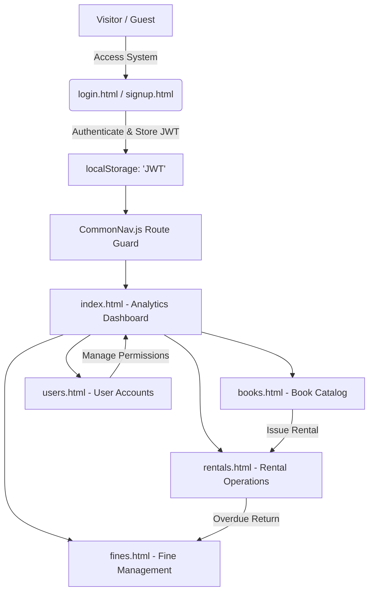

<div align="center">

# 📚 Smart Library & E-Book Rental System
### *Modern, Dark-Themed Glassmorphism Web Interface for Next-Gen Library Operations*

[](https://developer.mozilla.org/en-US/docs/Web/HTML)
[](https://developer.mozilla.org/en-US/docs/Web/CSS)
[](https://developer.mozilla.org/en-US/docs/Web/JavaScript)
[](https://jquery.com/)
[](https://spring.io/projects/spring-boot)
[](https://jwt.io/)
[]()

---

<p align="center">
  <b>Smart Library Management & E-Book Rental System Frontend</b> is a responsive, feature-rich, and visually stunning web application built to streamline digital book catalogs, rental issuing, return processing, overdue fine tracking, and member administration. Designed with a sleek futuristic dark mode glassmorphism UI, seamless micro-interactions, and real-time backend integration.
</p>

[Key Features](#-key-features) • [Tech Stack](#%EF%B8%8F-tech-stack) • [Page Showcase](#-page-showcase) • [Project Structure](#-project-structure) • [Setup & Installation](#-setup--installation) • [API Endpoint Mapping](#-api-endpoint-mapping) • [License](#-license)

</div>

---

## 🌟 Key Features

### 📊 **1. Real-time Analytics Dashboard (`index.html`)**
- **Live Performance Metrics**: Displays live cards for Total Cataloged Books, Active Rentals, Pending Unpaid Fines, and Registered Members.
- **Quick Operations Console**: One-click actions to instantly launch modals for book addition, rental issuing, fine processing, and user registration.
- **Recent Rental Logs**: Interactive activity table showing real-time borrow transactions, due dates, and status indicators.

### 📚 **2. Dynamic Book Catalog & E-Book Management (`books.html`)**
- **Full CRUD Management**: Add, update, view, and delete book entries with complete metadata (Title, Author, ISBN, Category, Total Copies, Available Copies, E-Book file paths).
- **Instant Search & Filtering**: Client-side and server-side title/author search query handling.
- **E-Book Reader & Download**: Direct action buttons to access digital copies or downloadable PDF files.
- **Direct Rental Issuing**: Instant "Rent Book" action directly from the catalog card view.

### 🔄 **3. Rental & Circulation Workflow (`rentals.html`)**
- **Issue & Return Processing**: Issue new rentals with automated borrow date & due date calculation.
- **Admin Approval Engine**: Multi-state workflow supporting `PENDING`, `APPROVED`, `REJECTED`, `RETURNED`, and `OVERDUE`.
- **Automated Availability Sync**: Modifies available book copy counts upon approval and return.

### 💰 **4. Automated Fine Management System (`fines.html`)**
- **Overdue Penalty Tracking**: Displays calculated fines linked to overdue book rentals and delinquent user accounts.
- **Payment Settlement**: One-click payment confirmation to convert fine status from `UNPAID` to `PAID`.
- **Status Filter**: Toggle between unpaid outstanding fines and historic paid receipts.

### 👥 **5. User Account Administration (`users.html`)**
- **Member Management**: Comprehensive list of registered system users, roles (`ADMIN`, `LIBRARIAN`, `USER`), and account statuses.
- **User Creation & Profile Updates**: Modal interfaces to onboard new library members or modify existing credentials.
- **Security Scoping**: Protects user operations via JWT authorization headers.

### 🔐 **6. JWT Authentication & Session Security (`login.html` & `signup.html`)**
- **Secure Token Handling**: Authenticates users against the Java Spring Boot backend and stores JWT in `localStorage`.
- **Route Guard Middleware**: `CommonNav.js` automatically verifies active session tokens and redirects unauthorized guests to `login.html`.
- **Dynamic User Badge**: Navigation bar displays the logged-in user's initials, name, and user ID.

---

## 🎨 Design & Visual Aesthetics

The application features a customized **Dark Glassmorphism Design System** defined in `styles.css`:

```css
/* Core Color Tokens */
--bg-dark: #090d16;          /* Deep Space Dark Background */
--bg-surface: #111827;       /* Surface Elevation Layer */
--bg-card: rgba(17,24,39,0.7);/* Translucent Glassmorphic Cards */
--primary: #8b5cf6;         /* Electric Violet Primary Accent */
--accent-cyan: #06b6d4;     /* Neon Cyan Secondary Accent */
--accent-emerald: #10b981;  /* Emerald Green Status Indicator */
--accent-amber: #f59e0b;    /* Amber Warning Indicator */
--accent-rose: #f43f5e;     /* Crimson Danger / Rose Indicator */
```

- **Typography**: Google Fonts [`Plus Jakarta Sans`](https://fonts.google.com/specimen/Plus+Jakarta+Sans) & [`Inter`](https://fonts.google.com/specimen/Inter) for clean legibility.
- **Icons**: Font Awesome 6.5.1 vector iconography.
- **Micro-Interactions**: Ambient radial gradient backdrops, glowing border effects on hover, smooth modal backdrop filters, and dynamic badge pills.

---

## 🛠️ Tech Stack

| Domain | Technology / Tool | Description |
| :--- | :--- | :--- |
| **Frontend Core** | HTML5, JavaScript (ES6+) | Standard structural layout and dynamic DOM scripting |
| **Libraries** | jQuery v3.7.1 | AJAX HTTP REST client & simplified selector manipulation |
| **Styling** | Vanilla CSS3 (Custom Variables) | Modern Dark Glassmorphism design system & responsive layout |
| **Typography & Icons** | FontAwesome 6.5.1, Google Fonts | Professional vector icons and modern sans-serif typography |
| **Backend Integration** | Java Spring Boot REST API | Remote/Local REST endpoints hosted at `http://localhost:8080/api` |
| **Authentication** | JSON Web Token (JWT) | Bearer header authentication stored in `localStorage` |

---

## 📂 Project Structure

```text
Smart-Library-Management-E-Book-Rental-System-Frontend/
├── 📄 index.html        # Analytics Dashboard & Recent Rental Activity
├── 📄 books.html        # Book Catalog, E-Book Reader & CRUD Modals
├── 📄 rentals.html      # Rental & Return Management Workflow
├── 📄 fines.html        # Fine Management & Payment Processing
├── 📄 users.html        # User Account & Member Administration
├── 📄 login.html        # Portal Login Page
├── 📄 signup.html       # Member Registration Page
├── 🎨 styles.css        # Core Glassmorphism Design System & CSS Tokens
└── 📁 JS/               # Modular JavaScript Modules
    ├── 📜 CommonNav.js  # Global Route Guard, JWT Headers, & User Profile Loader
    ├── 📜 Dashboard.js  # Dashboard Analytics Metrics & Recent Rentals Loader
    ├── 📜 Book.js       # Book CRUD operations, E-Book Download, & Search logic
    ├── 📜 Rental.js     # Rental issuing, Approval/Rejection, & Return handlers
    ├── 📜 Fine.js       # Fine list renderer & Payment API trigger
    ├── 📜 User.js       # User Management CRUD & Role Assigning handlers
    ├── 📜 Login.js      # Auth Login Form Handler & Token Storage
    └── 📜 Signup.js     # Auth Register Form Handler
```

---

## 🖥️ Page Showcase & Workflow Overview



### 📋 Module Overview

1. **Dashboard (`index.html`)**
   - High-level overview of system status with live counter stats.
   - Quick operation buttons for immediate task dispatch.

2. **Book Catalog (`books.html`)**
   - Grid & table view of books with live search filters.
   - Modals for adding new titles, updating copy numbers, or attaching digital file paths.

3. **Rentals & Circulation (`rentals.html`)**
   - Centralized issue modal with date pickers.
   - Action controls for approving pending borrow requests or processing returns.

4. **Fine Management (`fines.html`)**
   - Outstanding fine overview table.
   - One-click fine status toggles to settle pending payments.

5. **User Management (`users.html`)**
   - Complete directory of library members, librarians, and system administrators.
   - User creation and role modification forms.

---

## 🔗 API Endpoint Mapping

The frontend communicates with a **Spring Boot REST API** running by default at `http://localhost:8080/api`:

### 🔑 Authentication Endpoints
- `POST /api/auth/login` - Authenticate user & receive JWT token
- `POST /api/auth/register` - Create new user account

### 📖 Book Endpoints (`Book.js`)
- `GET /api/books/all` or `/api/books` - Retrieve all books in catalog
- `POST /api/books` - Add a new book to catalog
- `PUT /api/books` - Update existing book details
- `DELETE /api/books/{id}` - Delete a book entry

### 🔄 Rental Endpoints (`Rental.js`)
- `GET /api/rentals/all` or `/api/rentals` - Retrieve all rental records
- `POST /api/rentals` - Issue a new rental request
- `PUT /api/rentals/{id}/status` - Approve or reject a rental request
- `POST /api/rentals/return` - Mark a rented book as returned

### 💰 Fine Endpoints (`Fine.js`)
- `GET /api/fines/all` or `/api/fines` - Retrieve fine records
- `PUT /api/fines/{id}/pay` - Mark a fine as paid

### 👤 User Endpoints (`User.js`)
- `GET /api/users/all` or `/api/users` - Retrieve registered users
- `GET /api/users/{id}` - Get individual user profile
- `POST /api/users` - Register user from admin panel
- `PUT /api/users/{id}` - Update user profile & role
- `DELETE /api/users/{id}` - Delete user account

---

## 🚀 Setup & Installation

### Prerequisites
- Modern web browser (Google Chrome, Mozilla Firefox, Microsoft Edge, Brave, Safari).
- Running instance of the **Smart Library System Spring Boot Backend** on `http://localhost:8080`.
- (Optional) Local web server or VS Code Live Server extension.

### Step 1: Clone the Repository
```bash
git clone https://github.com/chathunga2007/Smart-Library-Management-E-Book-Rental-System-Frontend.git
cd Smart-Library-Management-E-Book-Rental-System-Frontend
```

### Step 2: Configure API Endpoint (If needed)
If your Spring Boot backend runs on a different port or host, update `API_BASE_URL` in [JS/CommonNav.js](file:///d:/Smart-Library-Management-E-Book-Rental-System-Frontend/JS/CommonNav.js#L1):

```javascript
const API_BASE_URL = "http://localhost:8080/api";
```

### Step 3: Run the Application
You can open the project directly in your browser or serve it using any HTTP server:

#### Option A: Using VS Code Live Server
1. Open the repository directory in Visual Studio Code.
2. Install the **Live Server** extension.
3. Right-click `login.html` or `index.html` and select **Open with Live Server**.

#### Option B: Using Python HTTP Server
```bash
# Python 3.x
python -m http.server 3000
```
Then open `http://localhost:3000` in your web browser.

#### Option C: Using Node.js `serve` or `http-server`
```bash
npx http-server -p 3000
```

---

## 🛡️ Security & Route Guards

- All protected requests automatically attach the `Authorization: Bearer <token>` HTTP header via jQuery AJAX pre-filters in `CommonNav.js`.
- If an API request returns `401 Unauthorized` or `403 Forbidden`, the user is automatically notified and redirected to `login.html`.
- Navigating to protected pages without a valid JWT token instantly triggers an authentication redirect.

---

## 🤝 Contributing

Contributions are welcome! If you'd like to improve the UI, add new features, or fix bugs:

1. Fork the repository.
2. Create a new feature branch (`git checkout -b feature/AmazingFeature`).
3. Commit your changes (`git commit -m 'Add some AmazingFeature'`).
4. Push to the branch (`git push origin feature/AmazingFeature`).
5. Open a Pull Request.

---

## 📜 License

Distributed under the **MIT License**. See `LICENSE` for more information.

---

<div align="center">
  <sub>Built with ❤️ for Modern Library & E-Book Management Systems. Designed & Developed by <b>Chathunga Bimsara</b>.</sub>
</div>